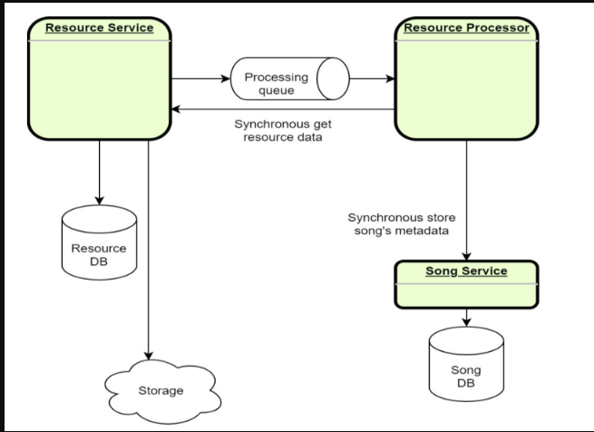

# microservices-fundamentals-learn

# Task 5

## What to do

In this task, it is needed to change the configuration to use the existing **Service Registry** tool. Sample
implementation: [Eureka Example](https://www.javainuse.com/spring/cloud-gateway-eureka)

[

## Sub-task 1: Service Registry

1. Update infrastructure of configuration to make sure that **Service Registry** is launched along with existing
   services.
2. Update clients using Eureka so that they will be called by service name instead of ip:port.
3. Implement Client-Side Balancing.

## Sub-task 2: API Gateway

1. Use API Gateway implementation - Spring Cloud Gateway.
2. Update infrastructure configuration to make sure that API Gateway is launched, exposed and there is a single-entry
   point in application.
3. Make sure that all services receive traffic from external clients through the API Gateway.
4. Properly handle errors (e.g., if service is not found or route doesn't exist).

## Sub-task 3: Service Configuration (Optional)

1. Create Git repository for storing all needed configuration at one place.
2. Create a service which will play the role of Service Configuration for other services.
3. Update infrastructure configuration by changing one (or more) services so to be able to communicate with Service
   Configuration.
4. Make sure that all service config clients receive configuration from Service Config.
5. Update service config client to be able to refresh configuration in case it was changed.

**Note.** In case there are issues with running all services on your local machine, for example, not enough CPU range or
RAM, here are the following options:

- use [docker limits](https://docs.docker.com/config/containers/resource_constraints/)
- use any cloud free tier system if it’s possible

# Task 4

## What to do

In this module you will need to adjust your services with containerization approach.

## Sub-task 1: Docker images

1. Package your applications as Docker images.
2. For each of your services:

- Create a new or modify an existing _Docker_ file that will contain instructions for packaging your project.
- Build a docker image and run it, mapping an external port to verify that application can be started and respond to
  requests.

## Sub-task 2: Docker Compose file

1. When all applications are successfully packaged, create a new or modify an existing _docker-compose.yml_ file that
   would list all applications and 3rd party dependencies to successfully start the project. Add init scripts for the
   database to run when container starts up. Once you have a compose file, you can create and start your application
   containers with a single command: `docker-compose up`.

Please note the following:

- Use an _.env_ file to replace all environment variables depending on the set-up.
- For 3rd party dependencies try to use the _–alpine_ images whenever it's possible.
- For project applications use the build property as these images are not going to be pulled from a public hub.
- Use logical service names to cross-reference services.

Possible container options for existing resources:

- [postgres DB](https://hub.docker.com/_/postgres)
- [mysql db](https://hub.docker.com/_/mysql)
- [RabbitMQ message broker](https://hub.docker.com/_/rabbitmq)
- [ActiveMQ message broker](https://hub.docker.com/r/rmohr/activemq)
- [Local stack (aws emulator)](https://hub.docker.com/r/localstack/localstack)

[

# Task 3

## What to do

In this module it is needed to adjust services with adding tests.

## Sub-task 1: Testing strategy

1. For solving this task, come up with a testing strategy and describe approach on how to ensure application stability
   and testing strategies:

- Unit tests
- Integration tests
- Component tests
- Contract tests
- End-to-end tests

2. Describe it in a short document what approach was chosen and how the combination of the strategies would help to
   solve task, e.g., either it's going to be 100% **unit tests** and **integration tests** or something else.

## Sub-task 2: Perform different types of testing

1. _Unit tests_: choose JUnit or Spock and choose module that need to be tested.
2. _Integration tests_: choose JUnit or Spock and cover integration layers.
3. _Component tests_: cover component scenarios on a business level, specifying exact scenario or scenarios and expected
   outcomes in a natural language, preferably using the Cucumber framework.
4. _Contract tests_: cover all contracts that are used in a specific scenario, preferably using
   the [Spring Cloud Contract](https://spring.io/projects/spring-cloud-contract) or Pact (contract tests should cover
   BOTH communication styles: synchronous HTTP and messaging, including stubs propagation).
5. _End-to-end tests_: all scenarios should be described in a natural language. Focus is on coverage on the API layer.
   Cucumber testing framework can be used in this case with the component tests from above.

**Note**

- At least one test should be executed for each test type.

# Task 2

## What to do

In this module it is needed to adjust services created in the first module with adding cross-servers calls.

## Sub-task 1: Asynchronous communication

1. Add asynchronous communication via messaging broker between **Resource Service** and **Resource Processor**.
2. On resource uploading, **Resource Service** should send information about uploaded resource to the **Resource
   Processor**, which contains “resourceId”.

[Rabbit MQ](https://hub.docker.com/_/rabbitmq), [ActiveMQ](https://hub.docker.com/r/rmohr/activemq) or any other broker
usage is possible.

## Sub-task 2: Events handling

1. When the **Resource Processor** has an event of receiving message, it uses a synchronous call to get the resource
   data (binary) from the **Resource Service**, parses the metadata, and uses the synchronous call to save the metadata
   of the song in the **Song. Service**.
2. Need to implement some way of queue listening/subscription. For
   example, [Rabbit Spring Streams](https://docs.spring.io/spring-cloud-stream-binder-rabbit/docs/current/reference/html/spring-cloud-stream-binder-rabbit.html)
   .

## Sub-task 3: Retry mechanism

While implementing communications between services it’s necessary to think about implementation of **Retry Mechanism**,
e.g: [Retry Pattern](https://docs.microsoft.com/en-us/azure/architecture/patterns/retry). Implementation can be based on
the [Spring Retry Template](https://docs.spring.io/spring-batch/docs/current/reference/html/retry.html) or annotations
for both synchronous and asynchronous communication.

**Note**

For this module you could use any of the messaging brokers for asynchronous communication (it’s better to discuss with
expert).

# Task 1

## What to do

In this module you will need to create base structure of microservices system. During this task you need to implement
the next three services:

- Resource service
- Song service
- Resource processor

## Sub-task 1: Resource service

For a Resource service, it is recommended to implement a service with CRUD operations for processing mp3 files. This
service will be used to store data. You should also use cloud storage or its emulation (
e.g. [S3 emulator](https://github.com/localstack/localstack)) to store the source file. Resource tracking (with resource
location in the cloud storage) should be carried out in the underlying database of the service.

**Service definition could be next:**

<table dir="auto"><tbody><tr><td><b>POST /resources</b></td><td colspan="6"><b>Upload new resource</b></td></tr><tr><td rowspan="2"><b>Request</b></td><td><i>Parameter</i></td><td><i>Description</i></td><td><i>Restriction</i></td><td><i>Body example</i></td><td><i>Description</i></td><td><i>Restriction</i></td></tr><tr><td></td><td></td><td></td><td>Audio data binary</td><td>Content type – audio/mpeg</td><td>MP3 audio data</td></tr><tr><td rowspan="2"><b>Response</b></td><td><i>Body</i></td><td><i>Description</i></td><td colspan="4"><i>Code</i></td></tr><tr><td>
{

&nbsp;&nbsp;&nbsp;&nbsp;"id":1123

}
</td><td>Integer id — ID of the created resource</td><td colspan="4">
200 – OK

400 – Validation failed or request body is invalid MP3

500 – An internal server error has occurred
</td></tr><tr><td><b>GET /resources/{id}</b></td><td colspan="6"><b>Get the binary audio data of a resource(s)</b></td></tr><tr><td rowspan="3"><b>Request</b></td><td><i>Parameter</i></td><td><i>Description</i></td><td><i>Restriction</i></td><td><i>Body example</i></td><td><i>Description</i></td><td><i>Restriction</i></td></tr><tr><td>Integer id</td><td>The ID of the resource to get</td><td>ID of an existing resource</td><td></td><td></td><td></td></tr><tr><td>HTTP Header Range</td><td>Range of resources to get</td><td>Optional, all if empty</td><td></td><td></td><td></td></tr><tr><td rowspan="2"><b>Response</b></td><td><i>Body</i></td><td><i>Description</i></td><td colspan="4"><i>Code</i></td></tr><tr><td>Audio bytes</td><td></td><td colspan="4">
200 – OK

206 – Partial content (if a range is requested)

404 – The resource with the specified id does not exist

500 – An internal server error has occurred
</td></tr><tr><td><b>DELETE /resources?id=1,2</b></td><td colspan="6"><b>Delete a resource(s). If there is no resource for id, do nothing</b></td></tr><tr><td rowspan="2"><b>Request</b></td><td><i>Parameter</i></td><td><i>Description</i></td><td><i>Restriction</i></td><td><i>Body example</i></td><td><i>Description</i></td><td><i>Restriction</i></td></tr><tr><td>String id</td><td>CSV (Comma Separated Values) of resource IDs to remove</td><td>Valid CSV length &lt; 200 characters</td><td></td><td></td><td></td></tr><tr><td rowspan="2"><b>Response</b></td><td><i>Body</i></td><td><i>Description</i></td><td colspan="4"><i>Code</i></td></tr><tr><td>
{

&nbsp;&nbsp;&nbsp;&nbsp;"ids": [1,2]

}
</td><td>Integer [] ids – ids of deleted resources</td><td colspan="4">
200 – OK

500 – An internal server error has occurred
</td></tr></tbody></table>

## Sub-task 2: Song service

For the Song service, it is recommended to implement a simple CRUD service to manage the song record (metadata). The
service should provide the ability to manage some metadata about the songs (artist, album, etc.). Make sure the service
is still available over HTTP.

**Service definition could be next:**

<table dir="auto"><tbody><tr><td><b>POST /songs</b></td><td colspan="6"><b>Create a new song metadata record in database</b></td></tr><tr><td rowspan="2"><b>Request</b></td><td><i>Parameter</i></td><td><i>Description</i></td><td colspan="2"><i>Body example</i></td><td><i>Description</i></td><td><i>Restriction</i></td></tr><tr><td></td><td></td><td colspan="2">
{

&nbsp;&nbsp;&nbsp;&nbsp;"name": "We are the champions",

&nbsp;&nbsp;&nbsp;&nbsp;"artist": "Queen",

&nbsp;&nbsp;&nbsp;&nbsp;"album": "News of the world",

&nbsp;&nbsp;&nbsp;&nbsp;"length": "2:59",

&nbsp;&nbsp;&nbsp;&nbsp;"resourceId": "123",

&nbsp;&nbsp;&nbsp;&nbsp;"year": ""1977

}
</td><td>Song metadata record, referencing to resource id (mp3 file itself)</td><td>MP3 audio data</td></tr><tr><td rowspan="2"><b>Response</b></td><td><i>Body</i></td><td><i>Description</i></td><td colspan="4"><i>Code</i></td></tr><tr><td>
{

&nbsp;&nbsp;&nbsp;&nbsp;"id":1123

}
</td><td>Integer id – ID of the created song metadata</td><td colspan="4">
200 – OK

400 – Song metadata missing validation error

500 – An internal server error has occurred
</td></tr><tr><td><b>GET /songs/{id}</b></td><td colspan="6"><b>Get song metadata</b></td></tr><tr><td rowspan="2"><b>Request</b></td><td><i>Parameter</i></td><td><i>Description</i></td><td><i>Restriction</i></td><td><i>Body example</i></td><td><i>Description</i></td><td><i>Restriction</i></td></tr><tr><td>Integer id</td><td>Song metadata ID to get</td><td>ID of an existing song metadata</td><td></td><td></td><td></td></tr><tr><td rowspan="2"><b>Response</b></td><td colspan="2"><i>Body</i></td><td colspan="2"><i>Description</i></td><td colspan="2"><i>Code</i></td></tr><tr><td colspan="2">
{

&nbsp;&nbsp;&nbsp;&nbsp;"name": "We are the champions",

&nbsp;&nbsp;&nbsp;&nbsp;"artist": "Queen",

&nbsp;&nbsp;&nbsp;&nbsp;"album": "News of the world",

&nbsp;&nbsp;&nbsp;&nbsp;"length": "2:59",

&nbsp;&nbsp;&nbsp;&nbsp;"resourceId": "123",

&nbsp;&nbsp;&nbsp;&nbsp;"year": ""1977

}
</td><td colspan="2"></td><td colspan="2">
200 – OK

404 – The song metadata with the specified id does not exist

500 – An internal server error has occurred
</td></tr><tr><td><b>DELETE /songs?id=1,2</b></td><td colspan="6"><b>Delete a song(s) metadata. If there is no song metadata for id, do nothing</b></td></tr><tr><td rowspan="2"><b>Request</b></td><td><i>Parameter</i></td><td><i>Description</i></td><td><i>Restriction</i></td><td><i>Body example</i></td><td><i>Description</i></td><td><i>Restriction</i></td></tr><tr><td>String id</td><td>CSV of song metadata IDs to remove</td><td>Valid CSV length &lt; 200 characters</td><td></td><td></td><td></td></tr><tr><td rowspan="2"><b>Response</b></td><td colspan="2"><i>Body</i></td><td colspan="2"><i>Description</i></td><td colspan="2"><i>Code</i></td></tr><tr><td colspan="2">
{

&nbsp;&nbsp;&nbsp;&nbsp;"ids": [1,2]

}
</td><td colspan="2">Integer [] ids - IDs of deleted resources</td><td colspan="2">
200 – OK

500 – An internal server error has occurred
</td></tr></tbody></table>

## Sub-task 3: Resource processor

This service will be used to process the source MP3 data in the future and will not have a web interface. At this point,
this should be a basic Spring Boot application capable of extracting MP3 metadata for further storage using the Song
service API.

Implement initial version of each service:

- Basic structure (Spring Boot)

**Note**

As a database, it is best to use Docker database/storage containers (
e.g. [postgres image](hhttps://hub.docker.com/_/postgres)) in the implementation.
