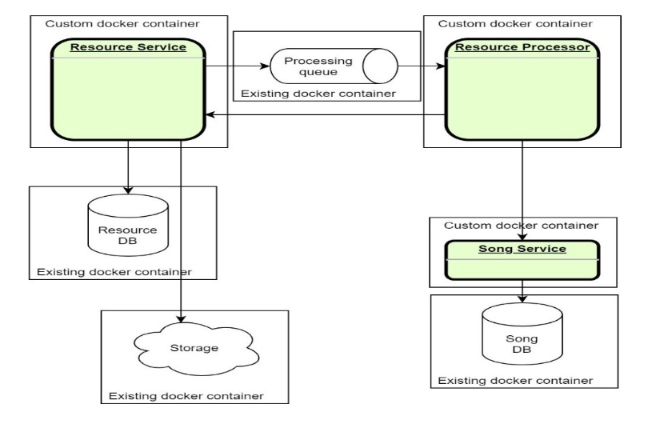
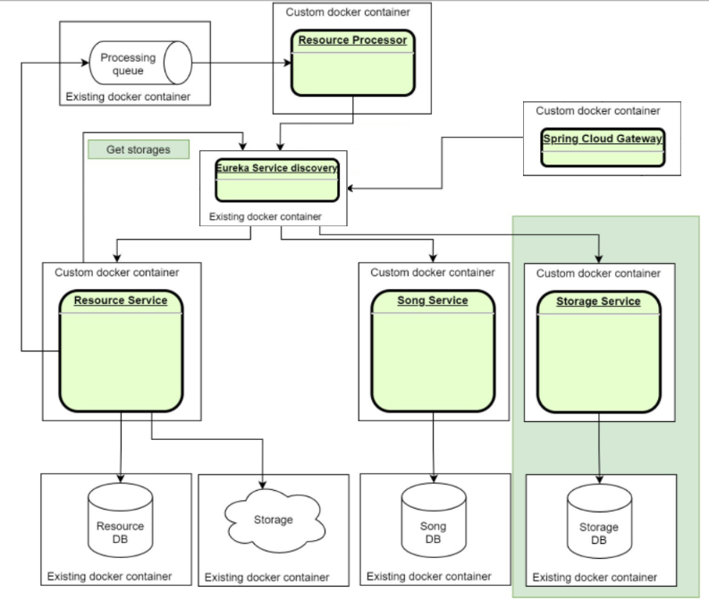
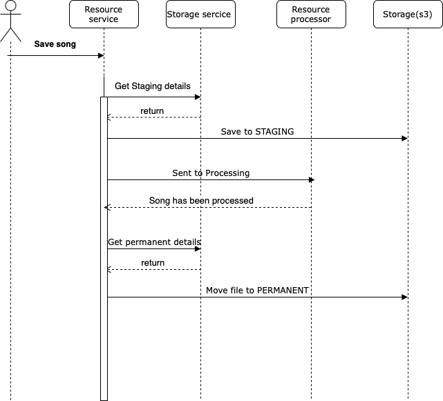

# microservices-fundamentals-learn

# Task 1

## What to do

In this module you will need to create base structure of microservices system. During this task you need to implement
the next three services:

- Resource service
- Song service
- Resource processor

## Sub-task 1: Resource service

For a Resource service, it is recommended to implement a service with CRUD operations for processing mp3 files. This
service will be used to store data. You should also use cloud storage or its emulation (
e.g. [S3 emulator](https://github.com/localstack/localstack)) to store the source file. Resource tracking (with resource
location in the cloud storage) should be carried out in the underlying database of the service.

**Service definition could be next:**

<table dir="auto"><tbody><tr><td><b>POST /resources</b></td><td colspan="6"><b>Upload new resource</b></td></tr><tr><td rowspan="2"><b>Request</b></td><td><i>Parameter</i></td><td><i>Description</i></td><td><i>Restriction</i></td><td><i>Body example</i></td><td><i>Description</i></td><td><i>Restriction</i></td></tr><tr><td></td><td></td><td></td><td>Audio data binary</td><td>Content type – audio/mpeg</td><td>MP3 audio data</td></tr><tr><td rowspan="2"><b>Response</b></td><td><i>Body</i></td><td><i>Description</i></td><td colspan="4"><i>Code</i></td></tr><tr><td>
{

&nbsp;&nbsp;&nbsp;&nbsp;"id":1123

}
</td><td>Integer id — ID of the created resource</td><td colspan="4">
200 – OK

400 – Validation failed or request body is invalid MP3

500 – An internal server error has occurred
</td></tr><tr><td><b>GET /resources/{id}</b></td><td colspan="6"><b>Get the binary audio data of a resource(s)</b></td></tr><tr><td rowspan="3"><b>Request</b></td><td><i>Parameter</i></td><td><i>Description</i></td><td><i>Restriction</i></td><td><i>Body example</i></td><td><i>Description</i></td><td><i>Restriction</i></td></tr><tr><td>Integer id</td><td>The ID of the resource to get</td><td>ID of an existing resource</td><td></td><td></td><td></td></tr><tr><td>HTTP Header Range</td><td>Range of resources to get</td><td>Optional, all if empty</td><td></td><td></td><td></td></tr><tr><td rowspan="2"><b>Response</b></td><td><i>Body</i></td><td><i>Description</i></td><td colspan="4"><i>Code</i></td></tr><tr><td>Audio bytes</td><td></td><td colspan="4">
200 – OK

206 – Partial content (if a range is requested)

404 – The resource with the specified id does not exist

500 – An internal server error has occurred
</td></tr><tr><td><b>DELETE /resources?id=1,2</b></td><td colspan="6"><b>Delete a resource(s). If there is no resource for id, do nothing</b></td></tr><tr><td rowspan="2"><b>Request</b></td><td><i>Parameter</i></td><td><i>Description</i></td><td><i>Restriction</i></td><td><i>Body example</i></td><td><i>Description</i></td><td><i>Restriction</i></td></tr><tr><td>String id</td><td>CSV (Comma Separated Values) of resource IDs to remove</td><td>Valid CSV length &lt; 200 characters</td><td></td><td></td><td></td></tr><tr><td rowspan="2"><b>Response</b></td><td><i>Body</i></td><td><i>Description</i></td><td colspan="4"><i>Code</i></td></tr><tr><td>
{

&nbsp;&nbsp;&nbsp;&nbsp;"ids": [1,2]

}
</td><td>Integer [] ids – ids of deleted resources</td><td colspan="4">
200 – OK

500 – An internal server error has occurred
</td></tr></tbody></table>

## Sub-task 2: Song service

For the Song service, it is recommended to implement a simple CRUD service to manage the song record (metadata). The
service should provide the ability to manage some metadata about the songs (artist, album, etc.). Make sure the service
is still available over HTTP.

**Service definition could be next:**

<table dir="auto"><tbody><tr><td><b>POST /songs</b></td><td colspan="6"><b>Create a new song metadata record in database</b></td></tr><tr><td rowspan="2"><b>Request</b></td><td><i>Parameter</i></td><td><i>Description</i></td><td colspan="2"><i>Body example</i></td><td><i>Description</i></td><td><i>Restriction</i></td></tr><tr><td></td><td></td><td colspan="2">
{

&nbsp;&nbsp;&nbsp;&nbsp;"name": "We are the champions",

&nbsp;&nbsp;&nbsp;&nbsp;"artist": "Queen",

&nbsp;&nbsp;&nbsp;&nbsp;"album": "News of the world",

&nbsp;&nbsp;&nbsp;&nbsp;"length": "2:59",

&nbsp;&nbsp;&nbsp;&nbsp;"resourceId": "123",

&nbsp;&nbsp;&nbsp;&nbsp;"year": ""1977

}
</td><td>Song metadata record, referencing to resource id (mp3 file itself)</td><td>MP3 audio data</td></tr><tr><td rowspan="2"><b>Response</b></td><td><i>Body</i></td><td><i>Description</i></td><td colspan="4"><i>Code</i></td></tr><tr><td>
{

&nbsp;&nbsp;&nbsp;&nbsp;"id":1123

}
</td><td>Integer id – ID of the created song metadata</td><td colspan="4">
200 – OK

400 – Song metadata missing validation error

500 – An internal server error has occurred
</td></tr><tr><td><b>GET /songs/{id}</b></td><td colspan="6"><b>Get song metadata</b></td></tr><tr><td rowspan="2"><b>Request</b></td><td><i>Parameter</i></td><td><i>Description</i></td><td><i>Restriction</i></td><td><i>Body example</i></td><td><i>Description</i></td><td><i>Restriction</i></td></tr><tr><td>Integer id</td><td>Song metadata ID to get</td><td>ID of an existing song metadata</td><td></td><td></td><td></td></tr><tr><td rowspan="2"><b>Response</b></td><td colspan="2"><i>Body</i></td><td colspan="2"><i>Description</i></td><td colspan="2"><i>Code</i></td></tr><tr><td colspan="2">
{

&nbsp;&nbsp;&nbsp;&nbsp;"name": "We are the champions",

&nbsp;&nbsp;&nbsp;&nbsp;"artist": "Queen",

&nbsp;&nbsp;&nbsp;&nbsp;"album": "News of the world",

&nbsp;&nbsp;&nbsp;&nbsp;"length": "2:59",

&nbsp;&nbsp;&nbsp;&nbsp;"resourceId": "123",

&nbsp;&nbsp;&nbsp;&nbsp;"year": ""1977

}
</td><td colspan="2"></td><td colspan="2">
200 – OK

404 – The song metadata with the specified id does not exist

500 – An internal server error has occurred
</td></tr><tr><td><b>DELETE /songs?id=1,2</b></td><td colspan="6"><b>Delete a song(s) metadata. If there is no song metadata for id, do nothing</b></td></tr><tr><td rowspan="2"><b>Request</b></td><td><i>Parameter</i></td><td><i>Description</i></td><td><i>Restriction</i></td><td><i>Body example</i></td><td><i>Description</i></td><td><i>Restriction</i></td></tr><tr><td>String id</td><td>CSV of song metadata IDs to remove</td><td>Valid CSV length &lt; 200 characters</td><td></td><td></td><td></td></tr><tr><td rowspan="2"><b>Response</b></td><td colspan="2"><i>Body</i></td><td colspan="2"><i>Description</i></td><td colspan="2"><i>Code</i></td></tr><tr><td colspan="2">
{

&nbsp;&nbsp;&nbsp;&nbsp;"ids": [1,2]

}
</td><td colspan="2">Integer [] ids - IDs of deleted resources</td><td colspan="2">
200 – OK

500 – An internal server error has occurred
</td></tr></tbody></table>

## Sub-task 3: Resource processor

This service will be used to process the source MP3 data in the future and will not have a web interface. At this point,
this should be a basic Spring Boot application capable of extracting MP3 metadata for further storage using the Song
service API.

Implement initial version of each service:

- Basic structure (Spring Boot)

**Note**

As a database, it is best to use Docker database/storage containers (
e.g. [postgres image](hhttps://hub.docker.com/_/postgres)) in the implementation.

# Task 2

## What to do

In this module it is needed to adjust services created in the first module with adding cross-servers calls.

## Sub-task 1: Asynchronous communication

1. Add asynchronous communication via messaging broker between **Resource Service** and **Resource Processor**.
2. On resource uploading, **Resource Service** should send information about uploaded resource to the **Resource
   Processor**, which contains “resourceId”.

[Rabbit MQ](https://hub.docker.com/_/rabbitmq), [ActiveMQ](https://hub.docker.com/r/rmohr/activemq) or any other broker
usage is possible.

## Sub-task 2: Events handling

1. When the **Resource Processor** has an event of receiving message, it uses a synchronous call to get the resource
   data (binary) from the **Resource Service**, parses the metadata, and uses the synchronous call to save the metadata
   of the song in the **Song. Service**.
2. Need to implement some way of queue listening/subscription. For
   example, [Rabbit Spring Streams](https://docs.spring.io/spring-cloud-stream-binder-rabbit/docs/current/reference/html/spring-cloud-stream-binder-rabbit.html)
   .

## Sub-task 3: Retry mechanism

While implementing communications between services it’s necessary to think about implementation of **Retry Mechanism**,
e.g: [Retry Pattern](https://docs.microsoft.com/en-us/azure/architecture/patterns/retry). Implementation can be based on
the [Spring Retry Template](https://docs.spring.io/spring-batch/docs/current/reference/html/retry.html) or annotations
for both synchronous and asynchronous communication.

**Note**

For this module you could use any of the messaging brokers for asynchronous communication (it’s better to discuss with
expert).

# Task 3

## What to do

In this module it is needed to adjust services with adding tests.

## Sub-task 1: Testing strategy

1. For solving this task, come up with a testing strategy and describe approach on how to ensure application stability
   and testing strategies:

- Unit tests
- Integration tests
- Component tests
- Contract tests
- End-to-end tests

2. Describe it in a short document what approach was chosen and how the combination of the strategies would help to
   solve task, e.g., either it's going to be 100% **unit tests** and **integration tests** or something else.

## Sub-task 2: Perform different types of testing

1. _Unit tests_: choose JUnit or Spock and choose module that need to be tested.
2. _Integration tests_: choose JUnit or Spock and cover integration layers.
3. _Component tests_: cover component scenarios on a business level, specifying exact scenario or scenarios and expected
   outcomes in a natural language, preferably using the Cucumber framework.
4. _Contract tests_: cover all contracts that are used in a specific scenario, preferably using
   the [Spring Cloud Contract](https://spring.io/projects/spring-cloud-contract) or Pact (contract tests should cover
   BOTH communication styles: synchronous HTTP and messaging, including stubs propagation).
5. _End-to-end tests_: all scenarios should be described in a natural language. Focus is on coverage on the API layer.
   Cucumber testing framework can be used in this case with the component tests from above.

**Note**

- At least one test should be executed for each test type.

# Task 4

## What to do

In this module you will need to adjust your services with containerization approach.

## Sub-task 1: Docker images

1. Package your applications as Docker images.
2. For each of your services:

- Create a new or modify an existing _Docker_ file that will contain instructions for packaging your project.
- Build a docker image and run it, mapping an external port to verify that application can be started and respond to
  requests.

## Sub-task 2: Docker Compose file

1. When all applications are successfully packaged, create a new or modify an existing _docker-compose.yml_ file that
   would list all applications and 3rd party dependencies to successfully start the project. Add init scripts for the
   database to run when container starts up. Once you have a compose file, you can create and start your application
   containers with a single command: `docker-compose up`.

Please note the following:

- Use an _.env_ file to replace all environment variables depending on the set-up.
- For 3rd party dependencies try to use the _–alpine_ images whenever it's possible.
- For project applications use the build property as these images are not going to be pulled from a public hub.
- Use logical service names to cross-reference services.

Possible container options for existing resources:

- [postgres DB](https://hub.docker.com/_/postgres)
- [mysql db](https://hub.docker.com/_/mysql)
- [RabbitMQ message broker](https://hub.docker.com/_/rabbitmq)
- [ActiveMQ message broker](https://hub.docker.com/r/rmohr/activemq)
- [Local stack (aws emulator)](https://hub.docker.com/r/localstack/localstack)

[

# Task 5

## What to do

In this task, it is needed to change the configuration to use the existing **Service Registry** tool. Sample
implementation: [Eureka Example](https://www.javainuse.com/spring/cloud-gateway-eureka)

[

## Sub-task 1: Service Registry

1. Update infrastructure of configuration to make sure that **Service Registry** is launched along with existing
   services.
2. Update clients using Eureka so that they will be called by service name instead of ip:port.
3. Implement Client-Side Balancing.

## Sub-task 2: API Gateway

1. Use API Gateway implementation - Spring Cloud Gateway.
2. Update infrastructure configuration to make sure that API Gateway is launched, exposed and there is a single-entry
   point in application.
3. Make sure that all services receive traffic from external clients through the API Gateway.
4. Properly handle errors (e.g., if service is not found or route doesn't exist).

## Sub-task 3: Service Configuration (Optional)

1. Create Git repository for storing all needed configuration at one place.
2. Create a service which will play the role of Service Configuration for other services.
3. Update infrastructure configuration by changing one (or more) services so to be able to communicate with Service
   Configuration.
4. Make sure that all service config clients receive configuration from Service Config.
5. Update service config client to be able to refresh configuration in case it was changed.

**Note.** In case there are issues with running all services on your local machine, for example, not enough CPU range or
RAM, here are the following options:

- use [docker limits](https://docs.docker.com/config/containers/resource_constraints/)
- use any cloud free tier system if it’s possible

# Task 6

## What to do

There are few options of implementation of circuit breaker in microservices communications.

The current implementation from the previous tasks do not have any near-static data, so in order to emulate a stubbed
circuit breaker, we need to add one more element that emulates this data.

1. Now our files can be in different states depends on processing phase: STAGING - file in processing, PERMANENT - file
   has been successfully processed;
2. To store and manage this states we will create Storage service. It will be asked by resource service for state
   details;
3. For case when Storage service in unavailable, we will extend resource service to use advantages of fault tolerance
   pattern.

## Sub-task 1: New Storage API

1. Create and implement new independent microservice with CRUD API which represents Storage concept. The service will be
   used for management of **storage** types.  
   Prior to this task, the **Resource Service** used its own configuration to access data stores (**s3 buckets**). Now
   this places configuration goes to new service.  
   When **Storage Service** starts at least two different storage types (**Storage object**) should be created in
   database by default which will be used by **Resource service**. The same storage buckets should be created in *
   *localstack**.  
   **Storage object** can have only the following **storageType** values: **STAGING** or **PERMANENT**. One for *
   *permanent** storage, another for **staging**. They should have different paths of buckets. Other storages can also
   be added via the Storage Service API.

<table dir="auto"><tbody><tr><td><b>POST /storages</b></td><td colspan="6"><i>Create new storage</i></td></tr><tr><td rowspan="2"><b>Request</b></td><td>Parameter</td><td>Description</td><td>Restriction</td><td>Body example</td><td>Description</td><td>Restriction</td></tr><tr><td></td><td></td><td></td><td>
{ "storageType": "PERMANENT",

&nbsp;&nbsp;&nbsp;&nbsp;"bucket": "bucket_name",

&nbsp;&nbsp;&nbsp;&nbsp;"path": "/files"}
</td><td>Content type – application/json Data representing particular storage place\space for binary data.</td><td></td></tr><tr><td rowspan="2"><b>Response</b></td><td colspan="2">Body</td><td colspan="2">Description</td><td colspan="2"><i>Code</i></td></tr><tr><td colspan="2">
{

&nbsp;&nbsp;&nbsp;&nbsp;"id":1123

}
</td><td colspan="2">Integer id – ID of created storage</td><td colspan="2">
200 – OK

400 – Validation error or request body is an invalid MP3

500 – Internal server error occurred.
</td></tr><tr><td><b>GET /storages</b></td><td colspan="6"><i>Gets storages list</i></td></tr><tr><td rowspan="2"><b>Request</b></td><td>Parameter</td><td>Description</td><td>Restriction</td><td>Body example</td><td>Description</td><td>Restriction</td></tr><tr><td></td><td></td><td></td><td></td><td></td><td></td></tr><tr><td rowspan="2"><b>Response</b></td><td colspan="3">Body</td><td>Description</td><td colspan="2">Code</td></tr><tr><td colspan="3">
&nbsp;&nbsp;&nbsp;&nbsp;"id": "1",

&nbsp;&nbsp;&nbsp;&nbsp;"storageType": "PERMANENT",

&nbsp;&nbsp;&nbsp;&nbsp;"bucket": "bucket_name",

&nbsp;&nbsp;&nbsp;&nbsp;"path": "/files"}]
</td><td>Existing storages list</td><td colspan="2">
200 – OK

500 – Internal server error occurred.
</td></tr><tr><td><b>DELETE /storages?id=1,2</b></td><td colspan="6"><i>Delete a resource oDelete storages by given ids (if storage for id is not presented – do nothing) r resources (song or songs). If song for id is not present – do nothing</i></td></tr><tr><td rowspan="2"><b>Request</b></td><td>Parameter</td><td>Description</td><td>Restriction</td><td>Body example</td><td>Description</td><td>Restriction</td></tr><tr><td>String id</td><td>CSV of storage ids to delete</td><td>Valid CSV Length &lt; 200 characters</td><td></td><td></td><td></td></tr><tr><td rowspan="2"><b>Response</b></td><td colspan="3">Body</td><td>Description</td><td colspan="2">Code</td></tr><tr><td colspan="3">
{

&nbsp;&nbsp;&nbsp;&nbsp;"ids": [1,2]

}
</td><td>Integer [] ids – ids of deleted storages</td><td colspan="2">
200 – OK

500 – Internal server error occurred.
</td></tr></tbody></table>

! Please pay attention that in local db we store common information about storage types, not about each file state.

2. Update system to interact with new storage service: Depends on file processing state we will store it in different
   location. (Different path/folder for file). To find out details about each state and appropriate storage path we will
   call storage service.

   So when new file comes to Resource service for processing, we save file to STAGING storage, update file state and
   path in local DB, then send the file foe further processing. When resource service receives signal from resource
   processor that file has been successfully processed, we change state of file to PERMANENT and update link in resource
   service local db.

   The diagrams below will help you understand what we are talking about.

   []
   [

Note: You can add more file states depends on your systems needs, but let's start with two to decrease system
complexity.

## Sub-task 2: Resilience

And finally we implement circuit breaker pattern. Imagine that storage service is down, but we do not want to make our
users wait until we repair services. So for such cases, when storage service in unavailable, we will store stub data in
resource service to emulate response from storage service. Emulates response should be the same as storage service would
return.

1. Add a [Resilience4j](https://mvnrepository.com/artifact/io.github.resilience4j/resilience4j-circuitbreaker) library
   for **Resource Service**.
2. Add the circuit breaker config to services (when calling **Storage API** get storages for storing processed files).
3. When an exception returns from the called service provide returning of the stub result.
4. Simulate a failure of the service by shutting down a called service (**Storage API Service**) and test the circuit
   breaker.

   # Task 7

## What to do

In this task it is needed to provide exist infrastructure with a Logging system.

## Sub-task 1: Adding logging

1. Update your infrastructure with any data
   storage ([influxdb](https://hub.docker.com/_/influxdb), [prometheus](https://hub.docker.com/r/prom/prometheus/), [elasticsearch](https://hub.docker.com/_/elasticsearch)).
2. Configure logging in applications to send logs to the new added log storage.
3. The logs should be gathered from the services, transferred and persisted into data storage.

## Sub-task 2: Monitoring

1. Provide a specific route to any visualization
   tool ([Grafana](https://hub.docker.com/r/grafana/grafana), [Kibana](https://hub.docker.com/_/kibana), etc.) in API
   Gateway service. Add it to docker-compose file and configure.
2. Make several dashboards (for instance, based on the metrics from JVMs, performance and Latency of the API Gateway
   etc.)

## Sub-task 3: Tracing

1. Add trace ID header to uploaded file request and propagate it via HTTP calls (if rest template used, possible to do
   it via thread-locals and http interceptors) and via queue (adding and extracting additional attribute to the
   message).
2. Extract Trace ID and find appropriate logs in your Visualization tool. Make sure you can find logs from all the
   involved services only by Trace ID.

## Example

Please, find below an example on how to add monitoring with prometheus and grafana and log aggregation with ELK stack:

- [Monitoring with prometheus and grafana and log aggregation using ELK stack: Part 1](https://medium.com/nerd-for-tech/creating-spring-boot-microservices-monitoring-with-prometheus-and-grafana-and-log-aggregation-ba4f20496942)
- [Monitoring with prometheus and grafana and log aggregation using ELK stack: Part 2](https://medium.com/nerd-for-tech/building-spring-boot-microservices-monitoring-with-prometheus-and-grafana-and-log-aggregation-5ed9ca7dda36)

**Note**

All additional components should be launched as containers via docker-compose files.

# Task 8

## What to do

In this task it is needed to implement oAuth for microservice. Pick with mentor better option: Do it with the help of
external Auth provider or use Spring authorization server.

## Sub-task 1: Security

1. Use two roles for implementation: Admin and User.
2. Protect **Storage API** post and delete methods with Admin access only using JWT token.
3. For supporting use any existing free Auth provider or create own provider with spring authorization server or
   Keycloak.
4. Create JWT token verification mechanism if it is required.
5. Check and verify access to API using [Postman](https://www.postman.com/downloads/) or other client tools.

## Sub-task 2: UI Application (Optional)

1. Create a simple UI application with storage form and table of storages.
2. Integrate it with Auth provider.

[

## Useful links

**Spring Authorization server:**

- [Spring authorization server sample](https://www.baeldung.com/spring-security-oauth-auth-server)

**Keycloak samples:**

- [A Quick Guide to Using Keycloak with Spring Boot](https://www.baeldung.com/spring-boot-keycloak)
- [Secure Spring Boot Application With Keycloak](https://dzone.com/articles/secure-spring-boot-application-with-keycloak)
- [Securing Spring Boot REST APIs with Keycloak](https://medium.com/devops-dudes/securing-spring-boot-rest-apis-with-keycloak-1d760b2004e)

**General:**

- [The OAuth 2.0 Authorization Framework specification](https://datatracker.ietf.org/doc/html/rfc6749)
- [OAuth2 Boot Implementation example](https://docs.spring.io/spring-security-oauth2-boot/docs/current/reference/html5/)
